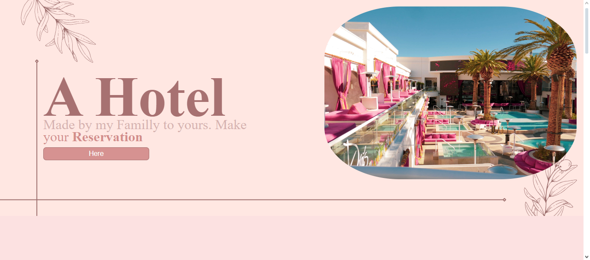

# Landing Page do Hotel

Bem-vindo à Landing Page do Hotel, um projeto desenvolvido para criar uma apresentação atraente e responsiva para um hotel genérico. Esta página é projetada para fornecer informações sobre o hotel e incentivar os visitantes a explorar mais.

## Demonstração

## Tecnologias Utilizadas

- HTML5
- CSS3

## Características

- **Design Atraente:** A página apresenta um design visualmente atraente, utilizando elementos gráficos e cores que refletem a atmosfera do hotel.

- **Responsividade:** A interface é responsiva, garantindo uma experiência de usuário consistente em uma variedade de dispositivos, desde desktops até dispositivos móveis.

- **Informações do Hotel:** Fornece informações sobre o hotel, como comodidades e imagens atraentes do local.

## Como Utilizar

1. Clone este repositório: `git clone https://github.com/johanpq/A-Hotel.git`
2. Abra o arquivo `index.html` em seu navegador web.

## Demonstração Online

Acesse a [demo online](https://johanpq.github.io/A-Hotel/) para explorar a Landing Page do Hotel ao vivo.

